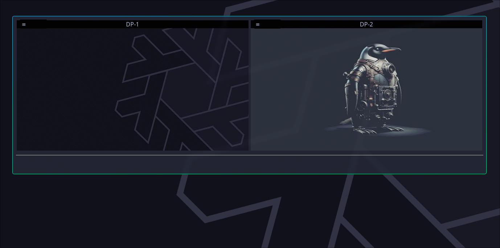

# Hypsi &middot; [](https://github.com/trevorjamesmartin/hypsi/blob/master/LICENSE)
> (hyprpaper management)



a simple [hyprpaper](https://wiki.hyprland.org/Hypr-Ecosystem/hyprpaper/) management tool

## Installing / Getting started

A quick introduction of the minimal setup you need to get Hypsi up & running.

Fedora (40, 41, 42, rawhide)
1. enable the [copr repo](https://copr.fedorainfracloud.org/coprs/yoshizl/hypsi/)
    ```shell
    sudo dnf copr enable yoshizl/hypsi
    ```
2. install the package
    ```shell
    sudo dnf install hypsi
    ```

Debian/Ubuntu & derivatives
- [download the equivalent RPM](https://copr.fedorainfracloud.org/coprs/yoshizl/hypsi/builds/) and convert into DEB with alien
    ```shell
    sudo apt-get install alien
    sudo alien hypsi-release.OS-arch.rpm
    sudo dpkg -i hypsi-release.OS-arch.rpm
    ```

## Developing

### Built With
- golang >= 1.22
- libheif >= 1.16
- webkit2gtk4.1

### Prerequisites
- Hyprland
- hyprpaper
- gcc-c++
- git

### Setting up Dev

Here's a brief intro about what a developer must do in order to start developing
the project further:


1. Clone this repo and enter the source folder
    ```source
    git clone https://github.com/trevorjamesmartin/hypsi
    cd hypsi
    ```
2. Resolve dependencies
    - (Nix) 
        ```source
        nix develop
        ```
    - (RPM)
        ```source
        cd rpm
        dnf builddep hypsi.spec
        ```

### Building

Once your build environment is ready to go:
- Go
    ```source
    # build a single executable Go binary
    go build
    ```    
- Nix
    ```source
    # build a NixOS compatible pkg
    nix build
    ```
- RPM
    ```source
    # build RPM & testing locally, (send SRPM to COPR builder)
    cd rpm
    sh pkg.sh
    ```

## Versioning

Use [SemVer](http://semver.org/) for versioning.

## Configuration

Here you should write what are all of the configurations a user can enter when using the project.

## Tests

```shell
fortune | cowsay
```

## Licensing

This project uses the BSD-3-Clause [LICENSE](https://github.com/trevorjamesmartin/hypsi/blob/master/LICENSE)