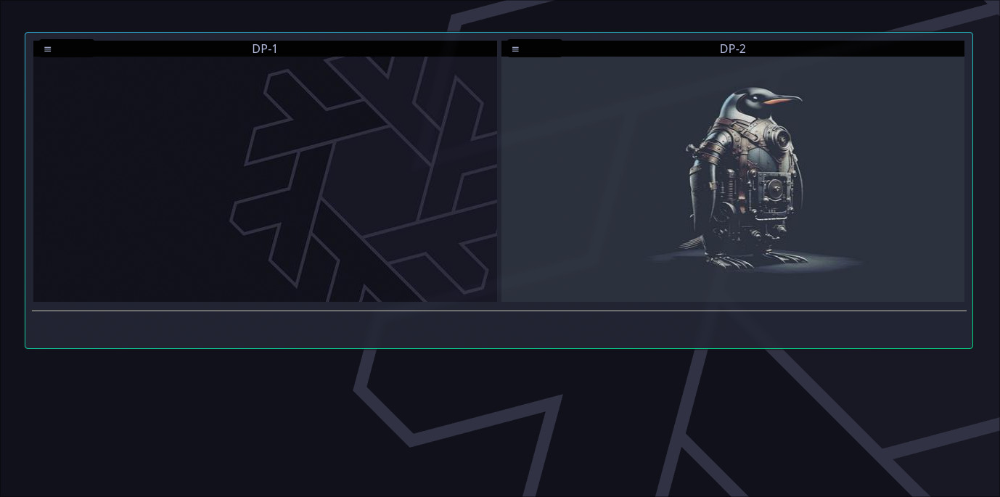

# Hypsi &middot;  &middot; [](https://github.com/trevorjamesmartin/hypsi/blob/master/LICENSE)



> a simple [hyprpaper](https://wiki.hyprland.org/Hypr-Ecosystem/hyprpaper/) management tool

## Installing / Getting started

<b>Fedora (40, 41, 42, rawhide)</b> binary releases are made available through COPR

to enable the [copr repo](https://copr.fedorainfracloud.org/coprs/yoshizl/hypsi/)
```shell
sudo dnf copr enable yoshizl/hypsi
```
install the package
```shell
sudo dnf install hypsi
```

## Developing

### Built With
- golang >= 1.22
- libheif >= 1.16
- webkit2gtk4.1

### Prerequisites
- Hyprland
- hyprpaper
- gcc-c++
- git

### Setting up

in order to start developing the project further:

Clone this repo and enter the source folder
```shell
git clone https://github.com/trevorjamesmartin/hypsi
cd hypsi
```

Resolve dependencies
```shell
# install tooling
yum install rpmdevtools rpm-build -y

# check the deps
yum builddep rpm/hypsi.spec        
```

### Building

Go
```shell
# build a single executable Go binary
go build
```

Nix
```shell
# build a NixOS compatible pkg
nix build
```

RPM
```shell
# build the RPM locally

# 1. prepare the source
spectool -g -R rpm/hypsi.spec
    
# 2. build the package
rpmbuild -ba rpm/hypsi.spec
```

## Versioning

Try to use [SemVer](http://semver.org/) for versioning.
+ RPM packages are stamped at build time, according to [(.spec)](../rpm/hypsi.spec)
+ Nix [(pkg)](../nix/package.nix) version should be kept in sync with (at least) `MAJOR.MINOR`

## Configuration

| name           | location              | contents |
|----------------|----------------------|---------|
|$XDG_CONFIG_HOME/hypsi/env | ~/.config/hypsi/env| runtime environment variables |

Setup:
```shell
 # create the folder if it doesn't exist
 mkdir -p ~/.config/hypsi
```
Example 1: <i>"Inspect Element"</i>
 ```shell
 # its helpful to allow "inspect element" while working on the webview template (OFF by default)
 echo "DEBUG=OK" >> ~/.config/hypsi/env
 ```

Example 2: <i>extract and customize the webview template</i>
```shell
# enter the config folder
cd ~/.config/hypsi

# extract the embedded templates
hypsi -develop

# apply the `-watch` flag for a responsive editing experience

hypsi -watch
```

## Tests

```shell
fortune | cowsay
```

## Workarounds

[NVIDIA GPU](./README_NVIDIA.md)

## Licensing

This project uses the BSD-3-Clause [LICENSE](https://github.com/trevorjamesmartin/hypsi/blob/master/LICENSE)

## Notes

The initial README file has been repurposed as an extension to this project introduction. If you'd like to dig deeper, [README-NEXT](./README-NEXT.md)
