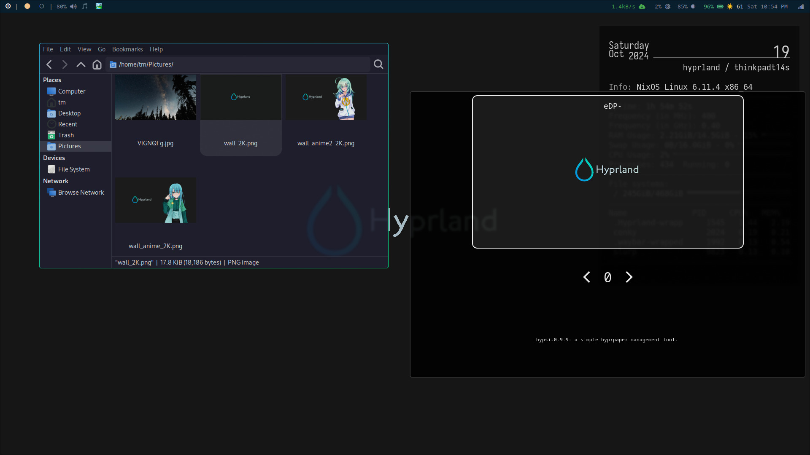
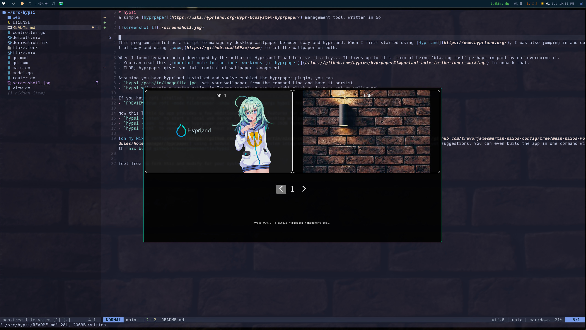
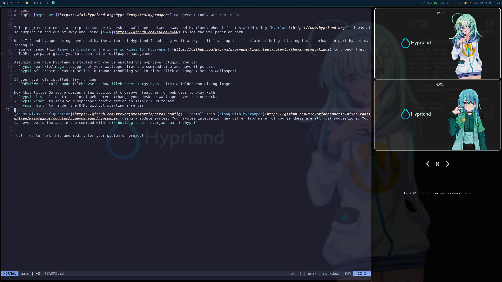

# hypsi
a simple [hyprpaper](https://wiki.hyprland.org/Hypr-Ecosystem/hyprpaper/) management tool, written in Go

now with optional webview interface

This program started as a script to manage my desktop wallpaper between sway and hyprland. When I first started using [Hyprland](https://www.hyprland.org/), I was also jumping in and out of sway and using [swww](https://github.com/LGFae/swww) to set the wallpaper on both.

When I found hypaper being developed by the author of Hyprland I had to give it a try... It lives up to it's claim of being 'blazing fast' perhaps in part by not overdoing it.
- You can read this [important note to the inner workings (of hyprpaper)](https://github.com/hyprwm/hyprpaper#important-note-to-the-inner-workings) to unpack that.
- TLDR; hyprpaper gives you full control of wallpaper management

Assuming you have Hyprland installed and you've enabled the hyprpaper plugin, you can
- `hypsi /path/to/imagefile.jpg` set your wallpaper from the command line and have it persist
- `hypsi %f` create a custom action in Thunar (enabling you to right-click an image > set as wallpaper)

If you have rofi istalled, try running
- `PREVIEW=true rofi -mode filebrowser -show filebrowser|xargs hypsi` from a folder containing images

Now this little Go app provides a few additional crossover features for web devs to play with
- `hypsi -json` to show your hyprpaper configuration in simple JSON format
- `hypsi -rewind` reset to previous image(s)
- `hypsi -webview` open the optional webview interface

your changes are automatically saved, rollback to a previously set wallpaper

take control of your hyprpaper

# templating

    windowrulev2= [
        ...
        "float,class:(hypsi)" # wallpaper history
        "size 1305 435,class:(hypsi)" # (two monitors)
        ...

The current default template, along with hyprland rulesv2 should provide a good starting point

In spirit with Hyprland, hypsi strives to be highly configuable & you're encouraged to override the defaults

To get started customizing the appearance,
- create & enter a work folder, `mkdir -p /path/to/templates;cd /path/to/templates`
- run `hypsi -develop` to write the base template files into your current working directory (if they do not already exist)
- to override a linked style or script file, remove the tag and replace it with inline style or script
- run `hypsi -watch` from your template folder or run `hypsi -watch /path/to/templates`

[on my NixOS configuration](https://github.com/trevorjamesmartin/nixos-config) I install this [along with hyprpaper](https://github.com/trevorjamesmartin/nixos-config/tree/main/nixos/modules/home-manager/hyprpaper) using a module system. Your system integration may differ from mine, of course these are all just suggestions. You can even build the app in one command with `nix build github:trevorjamesmartin/hypsi`

feel free to fork this and modify for your system or project

template contributions are welcome, creativity is encouraged!
